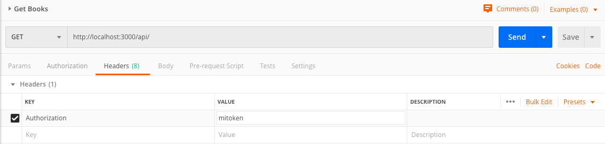

# Funciones asíncronas

[Ir a lección del curso](https://www.artisanfront.com/cursos/curso-fastify-desde-0/fastify-06-handlers-asincronos)

[¿Cómo instalar los demos?](../README.md)

## Ejecutar este demo

```sh
node index.js
```

Para este demo se envia se necesita enviar en el `request.headers` un token mediante la propiedad `Authorization`.

## ¿Cómo enviar request.headers con Postman?



Este demo tiene el ejemplo de como utilizar `async` y `await` en hooks y el handler de una ruta.
